# Árbol de Maestrías

Versión de diseño: `0.1`  
Estado: base aprobada para prototipo; cifras y habilidades sujetas a balance.

## Propósito

El Árbol de Maestrías reemplaza las clases rígidas. La identidad de un personaje
nace de lo que practica, el equipo que lleva, las maestrías que enfoca y las
decisiones permanentes que toma al alcanzar la Gran Maestría.

La fórmula general es:

`personaje = equipo actual + maestrías aprendidas + enfoques activos + reputación`

## Reglas fundamentales

1. El personaje no selecciona una clase durante su creación.
2. Las maestrías progresan realizando acciones significativas relacionadas con
   ellas; repetir acciones sin propósito no debe ser la estrategia óptima.
3. El equipo concede las acciones activas básicas. La maestría desbloquea
   técnicas compatibles, eficiencia, opciones y especialización.
4. Un personaje puede aprender todas las maestrías con suficiente dedicación.
5. Solo tres maestrías pueden estar **enfocadas** simultáneamente. Los enfoques
   se cambian en una zona segura y nunca durante un conflicto.
6. Los niveles altos deben ampliar opciones y profundidad más que entregar
   multiplicadores de poder imposibles de contrarrestar.
7. Cambiar de equipo permite cambiar de rol, pero no borra las decisiones
   permanentes tomadas dentro de cada maestría.

## Jerarquía general

```mermaid
flowchart TB
    M["Árbol de Maestrías"]

    M --> MAR["Maestrías Marciales"]
    M --> MUN["Maestrías del Mundo"]
    M --> OFI["Maestrías de Oficio"]
    M --> INF["Maestrías de Influencia"]

    MAR --> ARM["Armas"]
    MAR --> PRO["Protección"]
    MAR --> ARC["Arcanas — futuras"]
    ARM --> ESP["Espadas"]
    ARM --> ARCOS["Arcos"]
    ARM --> AST["Armas de asta"]
    ARM --> CON["Contundentes y hachas"]
    ARM --> DAG["Dagas"]
    ARM --> FOC["Bastones y focos"]
    PRO --> ESC["Escudos"]
    PRO --> TEL["Armadura de tela"]
    PRO --> CUE["Armadura de cuero"]
    PRO --> MET["Armadura metálica"]

    MUN --> REC["Recolección"]
    MUN --> AVE["Aventura"]
    MUN --> DOM["Domadura"]
    REC --> MAD["Silvicultura"]
    REC --> MIN["Minería"]
    REC --> BOT["Botánica"]
    REC --> CAZ["Caza"]
    REC --> PES["Pesca"]
    AVE --> EXP["Exploración"]
    AVE --> SUP["Supervivencia"]
    AVE --> NAV["Navegación"]
    AVE --> RAS["Rastreo"]
    DOM --> CAP["Captura"]
    DOM --> CRI["Crianza"]
    DOM --> ENT["Entrenamiento"]
    DOM --> DRA["Dragones — futuros"]

    OFI --> REF["Refinado"]
    OFI --> FAB["Fabricación"]
    OFI --> SER["Servicios"]
    REF --> CAR["Carpintería"]
    REF --> META["Metalurgia"]
    REF --> CUR["Curtiduría"]
    REF --> TEX["Textilería"]
    FAB --> HER["Herrería"]
    FAB --> ARQ["Arquería y flechería"]
    FAB --> SAS["Sastrería"]
    FAB --> NAVAL["Construcción naval"]
    FAB --> HERB["Alquimia y cocina"]
    SER --> REP["Reparación"]
    SER --> ENC["Encantamiento — futuro"]
    SER --> CAL["Control de calidad"]

    INF --> LOG["Comercio y logística"]
    INF --> ESPIO["Espionaje"]
    INF --> LID["Liderazgo"]
    LOG --> MER["Comercio"]
    LOG --> TRA["Transporte"]
    LOG --> CONTA["Contratos"]
    LOG --> VAL["Tasación"]
    ESPIO --> OBS["Observación"]
    ESPIO --> INFIL["Infiltración"]
    ESPIO --> FAL["Falsificación"]
    ESPIO --> SAB["Sabotaje"]
    LID --> MAN["Mando"]
    LID --> DIP["Diplomacia"]
    LID --> GOB["Gobierno"]
    LID --> MOR["Moral y organización"]
```

Los nodos organizadores, como `Armas`, `Recolección` o `Fabricación`, no tienen
Legado propio. Los Legados pertenecen a maestrías terminales concretas, como
Espadas, Arcos, Silvicultura, Construcción naval o Liderazgo.

`Liderazgo` es una maestría terminal con caminos internos de Mando, Diplomacia,
Gobierno y Moral; esos caminos no mantienen contadores de nivel independientes
en la primera versión. Esta excepción permite que Liderazgo tenga sus tres
Legados sin fragmentar el progreso social en cuatro medidores difíciles de
validar.

## Rangos de progresión

| Rango | Nivel de referencia | Resultado principal |
| --- | ---: | --- |
| Iniciado | 1 | Permite utilizar la familia y sus acciones básicas. |
| Aprendiz | 10 | Desbloquea la primera técnica o ventaja de comodidad. |
| Adepto | 25 | Abre estilos internos y decisiones de configuración. |
| Experto | 50 | Desbloquea técnicas avanzadas y equipo superior. |
| Maestro | 75 | Concede una ventaja distintiva y prepara la culminación. |
| Gran Maestro | 100 | Permite realizar el Juramento y escoger un Legado permanente. |

Los niveles exactos son referencias de diseño. Pueden recalibrarse sin cambiar
la estructura de rangos.

## Equipo, técnicas y rol

- El objeto equipado proporciona el conjunto básico de acciones y determina
  qué técnicas son compatibles.
- La maestría desbloquea técnicas alternativas que el jugador puede colocar en
  los espacios disponibles del arma, armadura o herramienta.
- El personaje conoce más técnicas de las que puede llevar simultáneamente.
- El rol actual emerge de la combinación. Por ejemplo, espada, escudo y metal
  producen un protector; arco, cuero y rastreo producen un explorador.
- Cambiar de configuración debe hacerse fuera del combate o bajo restricciones
  claras de tiempo, lugar y seguridad.

## Maestrías enfocadas

Cada personaje dispone de tres espacios de enfoque:

- Una maestría conserva siempre su nivel aunque deje de estar enfocada.
- Las ventajas normales permanecen disponibles cuando el equipo es compatible.
- La ventaja culminante o Legado solo puede activarse si esa maestría está
  enfocada y el personaje lleva el equipo requerido.
- Los enfoques se cambian en ciudades, bancos, entrenadores o lugares de
  descanso autorizados.

Esto permite que un personaje aprenda Espadas, Arcos, Carpintería y Liderazgo,
pero impide que utilice simultáneamente todas sus culminaciones.

## Legado de Gran Maestro

### Definición

Al alcanzar el nivel 100 de una maestría terminal, el personaje obtiene acceso
al **Juramento de Gran Maestría**. El Juramento presenta tres Legados y obliga a
elegir exactamente uno.

El Legado representa cómo ese personaje interpreta la maestría después de una
vida de práctica. Dos Grandes Maestros de Espadas pueden compartir nivel y arma,
pero culminar como duelista, guardián o combatiente de gran hoja.

### Reglas de permanencia

1. La elección es permanente para ese personaje.
2. No puede cambiarse mediante oro, moneda premium, consumibles, muerte,
   temporadas, pérdida de equipo ni cambio de facción.
3. Un personaje puede escoger un Legado en cada maestría terminal que lleve a
   nivel 100, pero solo puede activar los correspondientes a sus tres enfoques.
4. El Legado exige equipo compatible. Escoger un Legado de espada y escudo no
   permite utilizarlo llevando arco o espada a dos manos.
5. Las tres opciones se muestran desde niveles tempranos para permitir que el
   jugador planifique su trayectoria.
6. Antes del Juramento, el jugador puede probar las tres opciones en una prueba
   sin persistencia.
7. La confirmación final debe mostrar requisitos, efectos, contraataques y la
   advertencia explícita de irreversibilidad.
8. La única excepción es una intervención global de diseño cuando un Legado sea
   eliminado o reconstruido de forma incompatible; en ese caso el juego puede
   conceder una reselección extraordinaria a todos los afectados.

### Qué forma toma según la rama

| Familia | Forma habitual del Legado |
| --- | --- |
| Armas | Habilidad activa culminante compatible con una configuración. |
| Protección | Postura, reacción defensiva o regla especial de mitigación. |
| Recolección | Método exclusivo de extracción, detección o aprovechamiento. |
| Oficios | Firma artesanal, técnica de calidad o capacidad de fabricación. |
| Aventura y domadura | Técnica de viaje, supervivencia, vínculo u orden. |
| Comercio y logística | Contrato, maniobra de transporte o lectura económica. |
| Espionaje | Operación de información, infiltración, engaño o escape. |
| Liderazgo | Orden, doctrina, estandarte o herramienta de organización. |

Por tanto, todas las maestrías terminales pueden aspirar a tres Legados, pero no
todos deben ser ataques ni habilidades de combate.

## Ejemplo: Legados de Espadas

Los nombres y cifras son provisionales; la identidad y el contrajuego son la
parte que se considera aprobada.

### Último Acero

Legado de duelo para espada de una mano y mano libre. Activa una guardia breve;
si bloquea un ataque frontal compatible, habilita una respuesta inmediata de
alta precisión. Puede contrarrestarse fingiendo el ataque, atacando a distancia,
controlando al duelista o golpeándolo desde otro ángulo.

### Juramento del Bastión

Legado de protección para espada y escudo. El personaje adopta una postura que
reduce su movilidad, aumenta su estabilidad y protege parcialmente a aliados
cercanos situados detrás de él. Puede contrarrestarse flanqueando, rompiendo su
guardia, obligándolo a moverse o esperando que termine la postura.

### Vendaval de Hierro

Legado ofensivo para espada a dos manos. Inicia una secuencia visible de golpes
amplios que controla espacio y castiga grupos compactos. Consume recursos y
puede interrumpirse, esquivarse o evitarse manteniendo distancia.

## Ejemplo: Legados de Arcos

### Ojo del Horizonte

Legado de precisión para arco largo. Canaliza un disparo de alcance y
penetración excepcionales. La preparación es visible y puede romperse con
cobertura, presión o interrupción.

### Lluvia de Plumas

Legado de control territorial. Marca un área y lanza una descarga que castiga a
grupos y rutas estrechas. El área se anuncia antes del impacto y permite salir
de ella.

### Paso del Cazador

Legado móvil para arco corto. Combina un desplazamiento evasivo con un disparo
rápido o una marca. Puede contrarrestarse con control de movimiento, presión
sostenida o cerrando sus rutas de escape.

## Ejemplo: Legados de Liderazgo

Liderazgo también culmina, pero sus opciones son doctrinas y órdenes:

- **Estandarte del Juramento:** despliega un punto visible de reunión que mejora
  temporalmente la coordinación de aliados cercanos y que los enemigos pueden
  destruir.
- **Orden de Marcha:** organiza un desplazamiento grupal, mejorando la logística
  fuera del combate mientras el grupo mantiene formación y ruta.
- **Consejo de Hierro:** habilita una herramienta superior de organización,
  permisos y respuesta ante crisis internas de una facción.

Estas opciones requerirán límites de acumulación para impedir que varios líderes
dupliquen indefinidamente el mismo beneficio.

## Reglas de diseño para cualquier Legado

Todo Legado debe tener:

- Una fantasía claramente distinta de las otras dos opciones.
- Requisitos de equipo o contexto inequívocos.
- Coste, enfriamiento o coste de oportunidad.
- Señal visual y sonora reconocible.
- Una forma razonable de respuesta o contrajuego.
- Valor fuera de una simple mejora porcentual de daño o producción.
- Comportamiento documentado para PvE, PvP y conflictos grupales cuando
  corresponda.

## Alcance inicial del tutorial

La primera implementación solo necesita registrar progreso en:

- Espadas.
- Arcos.
- Armadura de tela.
- Armadura de cuero.
- Recolección básica.
- Carpintería y reparación.
- Exploración.
- Navegación.

El tutorial puede mostrar una vista previa de los rangos y Legados, pero no debe
pedir una elección permanente. La pantalla de cierre del naufragio resume las
maestrías iniciadas y explica que las decisiones culminantes llegarán mucho más
adelante.

## Datos persistentes mínimos

Cada maestría de personaje debe guardar al menos:

- Identificador estable de la maestría.
- Experiencia y nivel.
- Estado de enfoque.
- Identificador del Legado escogido o valor vacío.
- Fecha o evento del Juramento.

La elección del Legado debe validarse y persistirse en la capa autoritativa; el
cliente nunca decide por sí solo que puede cambiarla.
