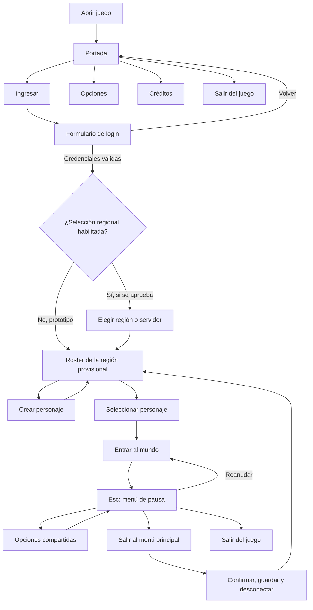

# Flujo de menús, sesión y ajustes

Versión de diseño: `0.1`  
Estado: navegación principal aprobada; arquitectura regional pendiente de
validación técnica y operativa.

## Propósito

Esta especificación define la navegación desde que se abre el juego hasta que
el personaje entra al mundo, el comportamiento del menú de pausa y las opciones
compartidas entre portada y juego.

La interfaz debe separar cuatro estados que no son equivalentes:

1. Aplicación abierta sin autenticar.
2. Cuenta autenticada, pero sin región o personaje activo.
3. Personaje seleccionado y conectado al mundo.
4. Menú superpuesto sobre una sesión de mundo que continúa existiendo.

## Decisiones cerradas

- La portada no muestra el formulario de login inmediatamente.
- La portada ofrece `Ingresar`, `Opciones`, `Créditos` y `Salir`.
- `Ingresar` abre el formulario dentro de la misma experiencia visual.
- Después de autenticar se accede al roster de personajes.
- No existe cambio directo de personaje desde el menú de pausa.
- Para utilizar otro personaje, el personaje actual debe salir completamente
  del mundo y el servidor debe confirmar guardado y desconexión.
- Solo puede existir un personaje activo por cuenta y región a la vez.
- Las opciones utilizan una misma interfaz reutilizable en portada y pausa.
- En un entorno multijugador, abrir el menú no pausa el mundo ni el servidor;
  solo bloquea el input local del jugador.

## Flujo general

La vuelta al roster no es un intercambio instantáneo. Antes de mostrar otro
personaje, la sesión de mundo anterior debe haberse cerrado en el servidor.

## Portada principal

### Acciones centrales

- **Ingresar:** abre el formulario de autenticación.
- **Opciones:** abre la interfaz común de ajustes sin requerir cuenta.
- **Créditos:** muestra equipo, licencias, herramientas y atribuciones de assets.
- **Salir:** solicita confirmación y cierra la aplicación.

### Información secundaria

La parte inferior puede mostrar:

- Versión del cliente.
- Estado de los servicios, cuando exista backend real.
- Avisos de mantenimiento.
- Enlaces legales, privacidad y soporte en versiones futuras.

## Login

El formulario contiene:

- Correo electrónico.
- Contraseña.
- Mostrar u ocultar contraseña.
- Recordar correo.
- Botón `Ingresar`.
- Botón `Volver`.
- Accesos futuros para crear cuenta y recuperar contraseña.

La aplicación puede recordar el correo, pero nunca debe guardar, registrar en
logs ni imprimir la contraseña. Durante el prototipo, la frontera de red puede
simular la autenticación, pero debe aceptar desde ahora ambos campos para no
acoplar la UI al mock actual basado solo en nombre de usuario.

## Roster y cambio de personaje

### Regla principal

El menú de pausa no incluye `Selección de personaje` ni `Cambiar personaje`.
Las únicas formas de abandonar al personaje activo son:

- `Salir al menú principal`, conservando la sesión autenticada cuando sea
  válido y regresando al roster después de la desconexión.
- `Salir del juego`, cerrando el personaje y la aplicación.
- Desconexión involuntaria, resuelta mediante las reglas futuras de reconexión.

### Secuencia obligatoria para usar otro personaje

1. El cliente solicita cerrar la sesión del personaje actual.
2. El servidor valida el estado y decide si exige una espera de salida segura.
3. Se persisten posición, inventario y progreso.
4. El servidor elimina al personaje activo del mundo.
5. Solo entonces el roster permite seleccionar otro personaje.

### Prevención de transferencias propias no deseadas

Para la primera versión:

- Los inventarios son por personaje.
- No existe un inventario global de cuenta.
- No existe correo directo entre personajes de la misma cuenta.
- No pueden conectarse dos personajes de la misma cuenta simultáneamente.
- Cualquier banco compartido, vivienda, mercado o almacén de facción se diseña
  posteriormente con reglas explícitas; no aparece como consecuencia accidental
  del roster.

Estas reglas reducen el intercambio directo entre personajes propios, aunque la
economía pública futura siempre requerirá medidas adicionales contra abuso.

## Región o servidor

### Estado de la decisión

La división entre `Américas`, `Europa` u otras regiones queda **pendiente** hasta
conocer población esperada, latencia, costes, capacidad de infraestructura y
arquitectura del backend.

### Dirección provisional

Si se implementan regiones separadas:

- La región se selecciona después del login y antes del roster.
- El roster muestra únicamente personajes de la región seleccionada.
- Al crear un personaje, se guarda un `region_id` permanente.
- La región no se cambia desde las opciones durante el juego.
- La pestaña General puede mostrar la región actual como información de solo
  lectura.
- El cliente puede recomendar una región por latencia, pero la elección final es
  explícita y se confirma antes de crear el personaje.

### Traslado futuro

Un posible traslado de servidor no será un ajuste común. Sería un servicio
separado sujeto a evaluación y, como mínimo, debería comprobar:

- Capacidad y disponibilidad del servidor de destino.
- Conflictos de nombre.
- Inventario, monedas y efectos sobre la economía regional.
- Mercado, correo, contratos y subastas pendientes.
- Facción, territorio, reputación y cargos políticos.
- Viviendas, almacenes, monturas y criaturas persistentes.
- Periodo de espera y frecuencia máxima de traslado.

No se promete esta función hasta resolver esas consecuencias.

## Menú de pausa

El menú abierto con `Esc` contiene:

- **Reanudar**.
- **Opciones**.
- **Salir al menú principal**.
- **Salir del juego**.

`Salir al menú principal` y `Salir del juego` solicitan confirmación. No existe
un botón de selección directa de personaje.

En el prototipo local puede mantenerse una pausa técnica temporal, pero la
arquitectura final solo debe bloquear movimiento, cámara e interacción del
cliente. El personaje permanece expuesto a las reglas del mundo online.

## Opciones compartidas

La misma escena de opciones se instancia desde portada y pausa. Contiene cinco
pestañas.

### General

- Idioma.
- Región actual como dato de solo lectura, si existen regiones.
- Mostrar consejos del tutorial.
- Confirmar antes de salir.
- Escala de interfaz.
- Restablecer ajustes.

### Video

- Modo: ventana, ventana sin bordes o pantalla completa.
- Monitor.
- Resolución mediante selector desplegable, no mediante un botón que recorre
  valores.
- V-Sync: desactivado, activado o adaptativo.
- Límite de FPS: sin límite, 30, 60, 90, 120, 144, 165 o 240.
- Preajuste: bajo, medio, alto o personalizado.
- Calidad de sombras.
- Antialiasing.
- Escala de renderizado en una versión posterior.

Los cambios de modo, monitor o resolución requieren `Aplicar` y una confirmación
con cuenta regresiva. Si no se confirma, se restaura automáticamente la
configuración anterior.

### Audio

- Volumen general.
- Música.
- Efectos.
- Ambiente.
- Interfaz.
- Voces, cuando existan.

Cada categoría utiliza un bus independiente, un deslizador de `0–100 %` y una
acción de silencio. Los buses se preparan aunque todavía no tengan contenido.

### Controles

Alcance inicial:

- Sensibilidad o velocidad de cámara.
- Velocidad de zoom.
- Preferencias de mantener o alternar cuando corresponda.
- Restablecer controles.

La reasignación completa de teclas se añade cuando las acciones de gameplay
estén estabilizadas.

### Accesibilidad

- Filtro desactivado, protanopia, deuteranopia o tritanopia.
- Intensidad del filtro.
- Tamaño de texto.
- Escala de interfaz.
- Reducir movimiento de cámara.
- Desactivar sacudidas.
- Reducir destellos.
- Subtítulos y tamaño de subtítulos cuando exista contenido hablado.

Los filtros de daltonismo pertenecen a Accesibilidad, no a Video, y deben
modificar la presentación mediante un filtro de pantalla sin alterar los assets
originales.

## Comportamiento de navegación

- `Esc` retrocede un nivel antes de cerrar todo el menú.
- Desde Opciones dentro del juego, `Esc` vuelve al menú de pausa.
- Desde Login, `Esc` vuelve a la portada.
- Los controles de teclado y mando mantienen un foco visible y predecible.
- Nunca se abandona el mundo o la aplicación sin confirmación cuando esa opción
  está habilitada.
- Las operaciones de red muestran estados `conectando`, `guardando`,
  `desconectando` y errores recuperables; no parecen bloqueos de interfaz.

## Arquitectura recomendada

- `SettingsManager`: autoload responsable de cargar, validar, aplicar y guardar
  preferencias locales.
- `options_menu.tscn`: escena reutilizable de las cinco pestañas.
- `main_menu.tscn`: contenedor de portada, login, créditos y estado de sesión.
- `NetworkManager`: autenticación, región, roster y cierre autoritativo de
  personaje.
- `GameManager`: transiciones de escenas y estado actual, sin almacenar
  contraseñas.
- `user://settings.cfg`: preferencias locales no sensibles.

Los cambios de audio, idioma y accesibilidad pueden previsualizarse al instante.
Los cambios de video delicados mantienen una copia temporal para poder
revertirse.

## Datos locales y datos de servidor

| Tipo de dato | Propietario | Ejemplos |
| --- | --- | --- |
| Ajuste local | Cliente | Resolución, audio, idioma, accesibilidad, controles. |
| Preferencia de cuenta | Backend futuro | Región preferida, consentimiento, opciones sincronizadas. |
| Estado de personaje | Servidor | Región, posición, inventario, maestrías, facción. |
| Sesión activa | Servidor | Cuenta conectada, personaje activo, token y desconexión. |

## Alcance de implementación inicial

1. Portada con Ingresar, Opciones, Créditos y Salir.
2. Login interno con correo y contraseña conectado al mock.
3. Opciones reutilizables con cinco pestañas.
4. Modo de pantalla, resolución desplegable, V-Sync y FPS funcionales.
5. Buses y controles de audio funcionales.
6. Filtros de daltonismo y reducción de efectos básicos.
7. Menú de pausa sin selección directa de personaje.
8. Guardado y restauración automática de preferencias.
9. Salida autoritativa simulada antes de regresar al roster.

## Preguntas abiertas

- ¿Existirá una sola región mundial durante el prototipo?
- ¿Cuándo se justifica separar Américas, Europa u otras regiones?
- ¿Cuántos personajes se permiten por cuenta y por región?
- ¿El logout en zonas peligrosas necesita espera o persistencia temporal?
- ¿Existirá alguna vez almacenamiento compartido entre personajes de una cuenta?
- ¿Se permitirán traslados regionales y bajo qué restricciones económicas?
- ¿Qué ajustes se sincronizan con la cuenta y cuáles permanecen por dispositivo?

## Estado del prototipo (22 de julio de 2026)

Ya están implementados la portada, el formulario de login conectado al servidor
simulado, créditos, las cinco pestañas de opciones, persistencia local, el menú
de pausa y la salida simulada y segura hacia el roster. La contraseña nunca se
guarda; solo puede recordarse el correo si el jugador lo autoriza.

Los controles de daltonismo, escala y movimiento ya conservan sus preferencias,
pero su efecto visual definitivo queda pendiente del sistema de postprocesado y
del tema de interfaz. La selección y el traslado de región siguen siendo una
decisión de arquitectura pendiente.
